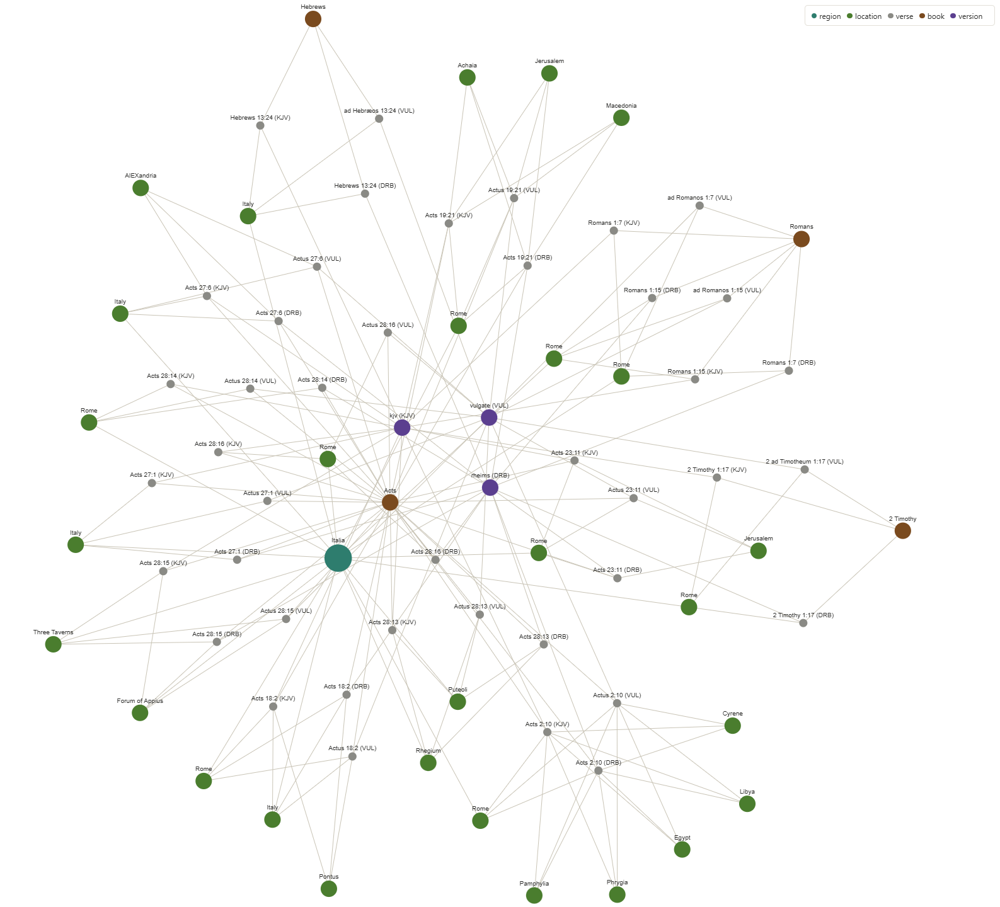
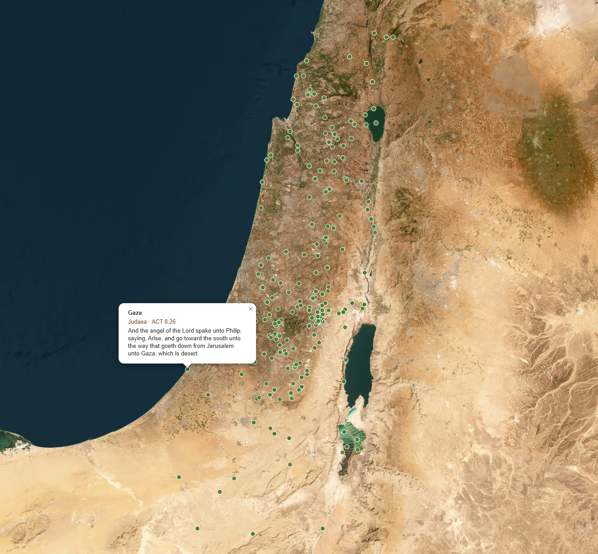

<p align="center">
  <a href="https://faithtech.com">
    
  </a>
  &nbsp;&nbsp;&nbsp;
  <a href="https://ftbuild.org.uk/projects.html#bibliagraphia">
    
  </a>
</p>

# Bibliagraphia

__Biblia__ & __Graphia__ — a study of different versions of the Holy Bible
using a **single-file DuckDB graph** to map versions and verses of the Bible
together with locations and regions.

This is a refactor of the original
[TypeDB](https://github.com/typedb/typedb) version of Bibliagraphia. The
graph is now a single-file DuckDB database (one `nodes` table, one `edges`
table) queried with parameterized recursive SQL, served by a FastAPI API
with a React (Vite) frontend.
The original TypeDB loader (`bible_loader.py`) and schema
(`bible_schema.tql`) are kept in the repo for reference.

## What and Why?

The Bible exists in many translations, and most tools treat it as a flat book: search by keyword, look up by reference.
Bibliagraphia instead stores open-licensed translations (KJV, Latin Vulgate, Douay–Rheims, Lexham English Bible, Statistical Restoration Greek New Testament and hopefully more...) in a single queryable graph: 
- verses connect to their books and versions
- every place mentioned connects to a geocoded location and its region.
The result is a non-linear way to explore the scriptures: walk the graph around a verse, compare one verse side by side across translations,
trace the shortest path from a book to a region, or plot every place a book mentions on a Roman Empire–era map.





## Acknowledgements

Bibliagraphia has been selected as one of the fifteen project briefs for [BUILD 26](https://ftbuild.org.uk/projects.html#bibliagraphia), the [FaithTech](https://faithtech.com) UK hackathon, where the focus will be exploring how the graph could power a personal knowledge graph — mapping reflections onto verses — and finding new ways to visualise the connections. Thanks to the BUILD team for including an independent project among the briefs.

## Overview

The graph database maps Bible verses with:
- Multiple translations (Vulgate, Douay-Rheims, King James)
- Geographical location references
- Regional information
- Full book and chapter structure

## Data sources

The database is built from the canonical JSON files in `/data`:

- `books.json` — Bible books with translation names (73 books)
- `versions.json` — Bible version information (VUL, DRB, KJV, LEB, SRG)
- `verses.json` — Complete verse text (141,788 verses across 5 versions; SRG is New Testament only)
- `location_regions.json` — Geographical locations with coordinates (7,460 mentions)
- `regions.json` — Regional descriptions and keywords (36 regions)
- `figures.json` — Major biblical figures (238), each with a STEP Bible TIPNR id

Figure → verse links (`figure_in_verse` edges) use two datasets from
[STEP Bible](https://www.STEPBible.org): TIPNR (every verse each person
appears in) and TVTMS (verse-numbering differences between Bible traditions).
STEP Bible asks that their data isn't redistributed, so it isn't stored in
this repo: `scripts/build_db.py` downloads it from their GitHub on the first
build and caches it in `data/.stepbible/` (gitignored). Without internet
access the build still works, just without figure edges.

## Schema design

The graph is heterogeneous, stored in two tables:

### `nodes` — one row per graph vertex

| column                                                    | purpose                                                             |
|-----------------------------------------------------------|---------------------------------------------------------------------|
| `id`                                                      | synthetic key, e.g. `book:GEN`, `verse:DRB:GEN:1:1`, `region:Syria` |
| `label`                                                   | node type: `version` / `book` / `verse` / `region` / `location`     |
| `name`                                                    | human-readable name (for search & display)                          |
| `version_code`, `book_code`, `chapter`, `verse_number`    | pulled-out query columns for verses/locations                       |
| `attrs` | JSON blob of all other type-specific attributes |

### `edges` — one row per directed relation

| label                | from -> to         | meaning                      |
|----------------------|--------------------|------------------------------|
| `verse_in_book`      | book -> verse      | a book contains a verse      |
| `verse_in_version`   | version -> verse   | a version contains a verse   |
| `location_in_verse`  | verse -> location  | a verse mentions a location  |
| `location_in_region` | region -> location | a region contains a location |

There are deliberately **no self-referencing foreign keys**: edges are only created between
nodes actually present (referential integrity), which keeps the graph clean.

## Quick start

Python 3.9 or newer is supported.

```bash
# Either install from pyproject (creates the `bibliagraphia` package + entrypoints):
uv venv venv && source venv/bin/activate && uv pip install -e ".[dev]"

# …or just the runtime deps:
# uv pip install -r requirements.txt

# 1. Build the graph from the JSON sources (a few seconds):
venv/bin/bibliagraphia-build     # -> data/bible.db
# (equivalent to: venv/bin/python scripts/build_db.py)

# 2. Run the API (port 8000):
venv/bin/uvicorn app.api:app --reload

# 3. Run the React frontend (see "Vite + React frontend" below) — or the
#    full two-container stack with `docker compose up -d --build`, which
#    serves the app at http://localhost:8080.
```

The API auto-builds `data/bible.db` from the JSON on first run if it's
missing, so step 1 is optional for local play.

### Vite + React frontend

#### Local Docker hot reload

Use the explicit development override to run Vite instead of nginx at
`http://127.0.0.1:8080` (Docker Compose v2+):

```bash
docker compose -f docker-compose.yml -f docker-compose.dev.yml up -d --build
```

Frontend source, public assets, HTML and Vite configuration are bind-mounted.
React edits update the browser automatically using Hot Module Replacement;
Vite configuration changes restart the dev server automatically. Polling
supports file changes through Docker Desktop mounts. Dependencies stay inside
the image, separate from host `node_modules`. After changing either dependency
manifest, rebuild only the frontend:

```bash
docker compose -f docker-compose.yml -f docker-compose.dev.yml up -d --build --no-deps frontend
```

The API container and its image-built Bible database are unchanged. Vite
proxies API requests to `http://api:8000` in this mode; normal host development
still uses `http://127.0.0.1:8000`. Python edits are not hot-reloaded.

Switch back to the production-style nginx frontend with:

```bash
docker compose -f docker-compose.yml up -d --build --no-deps frontend
```

Railway continues building the final nginx stage of the same Dockerfile.
It does not use the development override, source mounts or file watchers.

#### Host development

The standalone React frontend lives in `frontend/` and is the sole UI for
the API. Start the API in one terminal, then run:

```bash
cd frontend
npm install
npm run dev
```

The frontend uses Vite, React, and Tailwind CSS. Tailwind utility classes can be
used directly in the JSX components under `frontend/src/`.
The header logo links to the home page. Open the settings menu (three-line
icon) to switch between light and dark mode; the choice is saved across pages.
Open `/relationships` for a full-viewport relationship graph. It starts at
Genesis by default. The centre selector and depth control sit together at the
graph's top left. Click the selector to search across books, passages,
places, translations and regions, with up to three suggestions per type.
Choosing a suggestion automatically sets its type and exact node ID.
The three-dot menu includes **Show node names** to display all graph labels.
This preference is saved in the browser; hover and zoom labels still work when
the toggle is off. Graph labels use rounded, theme-aware backgrounds, with a
node-coloured border for the centre and hovered node.
Depth offers 1–20 hops and defaults to 3. The selected node, type and depth are
saved in browser storage and restored when returning to Relationships.
The URL includes depth as well as node identity for refreshes and sharing;
explicit URL values take priority over saved selections. The 200-node cap still
applies, so larger depths may show a truncated neighbourhood.
Relationships uses passage-first, branch-limited expansion: each branch initially
explores up to 10 verse nodes, 5 place nodes and 5 nodes of each other type.
The sidebar lists hidden direct connections; **Show more connections** widens
the selected centre's branch while retaining the total 200-node budget.
Select another node to explore its branch. Hidden counts are distinct neighbours
not loaded in this graph, not a total count of all paths or passages.
Verse translations and repeated place mentions remain separate exact-ID nodes.
The embedded Explore graph retains its original expansion behaviour.

Choose a centre and depth to explore another neighbourhood. Selecting a node
redraws immediately; depth changes redraw after a short pause. No Draw graph
button is needed on this page. Node
symbols identify books, verses, translations, places and regions. Drag to pan,
scroll to zoom, click a node to explore its neighbours, or use the node picker
inside the three-dot options control beside the depth selector
for keyboard navigation. **Fit graph** and fullscreen controls sit at the top
right; the node-type key sits at the bottom right. **Fit graph** restores the view.
Node/connection counts and truncation status sit at the bottom left.
The existing graph does not include people nodes.
Underlined places in the reader open details with a **Graph relationships**
preview showing the place and up to six directly connected nodes. Its **Expand**
control opens the full graph centred on that exact place mention. Selecting a graph node preserves its
identity, including passages sharing a book name. Verse details show passage
text, a **Read passage** link, and links to directly connected places and their
maps. Place details link back to the reader and map. Graph centres are saved in
the Relationships URL for reloads and sharing.
Selected node details appear beside the graph in a right-hand sidebar, stacking
below the graph on narrow screens.
The sidebar groups directly connected nodes into collapsible sections by type.
Each entry describes its relationship to the selected node and opens that exact
node when clicked. Counts describe the loaded graph, not the entire database;
capped graphs show a reminder that additional connections may exist.
Map markers are circles across the map, explorer and reader previews.
Open `/read` in the Vite app to read a Bible book. Choose a book, chapter,
translation, or jump directly to a verse; previous/next controls move between
chapters.
Use **+ Add translation** beside the reader title to compare translations
side by side. Shared book, chapter and verse controls keep columns in sync;
verses align by number (numbering can differ between translations). Unavailable
text is labelled rather than replaced with another passage. Remove columns
with their **×** buttons; comparison selections are preserved in the reader URL.
On narrow screens, scroll the comparison horizontally.
Underlined place mentions in every column open place
details with links to the graph and map. Open `/map` to browse all mappable
places; select a marker to read the passages that mention it.
Use the map's search box to find places by name or alternative name. Choose an
autocomplete suggestion (or use the arrow keys and Enter) to zoom to that place
and open its passages.
The expand control on a place's preview map smoothly grows it into the full
map, preserving its centre and zoom. Browser Back restores the passage and
place sidebar. The animation uses the View Transitions API; unsupported
browsers and reduced-motion preferences retain normal page navigation.

Open the Vite URL shown in the terminal (normally `http://localhost:5173`).
Vite proxies API requests to `http://127.0.0.1:8000`. For a deployed frontend
or an API on another host, set `VITE_API_BASE_URL` before building, for example
`VITE_API_BASE_URL=https://api.example.org npm run build`.

## API

All endpoints use parameterized SQL (no string interpolation), so there is
no SQL-injection surface.

| method & path                                                 | body / params                                  | returns                                          |
|---------------------------------------------------------------|------------------------------------------------|--------------------------------------------------|
| `GET /health`                                                 | —                                              | `{status, db, empty}`                            |
| `GET /search?q=&label=`                                       | `q` prefix, optional `label` filter            | autocomplete node list                           |
| `POST /traverse`                                              | `{start_node, label, edge}`                    | recursive descendants along `edge` + their edges |
| `POST /path`                                                  | `{source, source_label, target, target_label}` | shortest path (BFS) between two nodes            |
| `GET /graph?node=&label=&node_id=`                            | node name and label; optional exact node ID     | nearby nodes and relationship edges              |
| `GET /map/points?region=&book=&limit=`                        | a region or book code                           | geocoded location mentions for selected scope    |
| `GET /map/places`                                              | —                                              | unique mappable places with repeated mentions grouped |
| `GET /verse?book_code=&chapter=&verse_number=`                | verse reference                                | the same verse across all versions               |
| `GET /reader/catalog?version_code=`                           | optional version code (defaults to `KJV`)      | books, translations, and available chapters      |
| `GET /chapter?book_code=&chapter=&version_code=`              | passage reference                              | ordered verse text and linked location nodes     |
| `GET /place/relations?location_id=`                           | location mention node ID                       | translations and other references for the place  |
| `GET /explain?book_code=&chapter=&verse_number=&version_code=` | verse reference                                | graph context for the verse + a DeepSeek chat explanation (needs `FAITHTECH_API_KEY`) |

Examples:

```bash
# all locations in Syria
curl -XPOST localhost:8000/traverse -H 'content-type: application/json' \
     -d '{"start_node":"Syria","label":"region","edge":"location_in_region"}'

# cross-version John 3:16
curl "localhost:8000/verse?book_code=JOH&chapter=3&verse_number=16"

# autocomplete
curl "localhost:8000/search?q=Jer&label=location"

# explain a verse (set FAITHTECH_API_KEY on the server first)
curl "localhost:8000/explain?book_code=JOH&chapter=3&verse_number=16"
```

### Verse explanations (AI)

`GET /explain` gathers the graph's own facts for a verse — the verse in
every available translation, the verses immediately above and below for
reading context, the places the graph links to it, and those places'
region descriptions — then asks the FaithTech-hosted DeepSeek model
(BreezeSeekVision, OpenAI-compatible) for a chat reply explaining the
passage, the place, and the persons involved. The model only ever sees
facts the backend gathered; it is instructed never to invent places the
graph does not link. BreezeSeekVision is a reasoning model that plans
before it writes; the backend strips its planning block, so the reply
shown to the reader is the explanation itself.

The reply carries the evidence with it:

```json
{
  "reference": {"book_code": "JOH", "book_name": "...", "chapter": 3, "verse_number": 16, "version": "KJV"},
  "verse":     {"text": "...", "versions": [{"code": "KJV", "text": "..."}, {"code": "DRB", "text": "..."}]},
  "context":   {"previous": {"chapter": 3, "verse_number": 15, "text": "..."}, "next": {"...": "..."}},
  "locations": [{"name": "Damascus", "region": "Syria", "latitude": 33.52, "longitude": 36.31}],
  "regions":   [{"name": "Syria", "keywords": "...", "description": "..."}],
  "explanation": "the model's chat reply"
}
```

Configuration (environment variables on the API server):

| variable             | default                            | purpose                         |
|----------------------|------------------------------------|---------------------------------|
| `FAITHTECH_API_KEY`  | — (required)                       | bearer token for the API         |
| `FAITHTECH_API_BASE` | `https://mq2yi3izzu14g5-8000.proxy.runpod.net/v1` | OpenAI-compatible base URL       |
| `FAITHTECH_MODEL`    | `BreezeSeekVision`                  | model name                       |
| `FAITHTECH_TIMEOUT`  | `60`                               | request timeout (seconds)        |
| `FAITHTECH_MAX_TOKENS`| `6000`                             | token budget per model reply      |

Without a key the endpoint still gathers the graph context but returns
`{"error": "FAITHTECH_API_KEY is not set ..."}`.

## MCP server

The API also speaks the [Model Context Protocol](https://modelcontextprotocol.io)
(streamable HTTP) at **`/mcp`** — same process, same port, no extra
infrastructure ([FastMCP](https://gofastmcp.com) mounted into the FastAPI
app). Any MCP-capable LLM client can walk the Bible graph directly.

The tools wrap the same route handlers as the REST API — one
implementation, two interfaces:

| tool                  | wraps                 | purpose                                            |
|-----------------------|-----------------------|----------------------------------------------------|
| `search_nodes`        | `GET /search`         | autocomplete / resolve names to codes              |
| `get_verse`           | `GET /verse`          | one verse across all versions                      |
| `read_chapter`        | `GET /chapter`        | ordered chapter text with location links           |
| `reader_catalog`      | `GET /reader/catalog` | books, versions, available chapters                |
| `traverse_graph`      | `POST /traverse`      | recursive walk along one edge type                 |
| `find_path`           | `POST /path`          | shortest path between two nodes                    |
| `graph_neighborhood`  | `GET /graph`          | ego-graph around a node                            |
| `map_locations`       | `GET /map`            | geocoded mentions (lat/lng + verse text)           |
| `explain_verse`       | `GET /explain`        | verse explanation from the graph context via the FaithTech DeepSeek model |

### Connect an MCP client

Claude Desktop / Claude Code (`claude_desktop_config.json` or
`.mcp.json`):

```json
{
  "mcpServers": {
    "bibliagraphia": {
      "url": "https://api.bibliographia.com/mcp"
    }
  }
}
```

Cursor, or any streamable-HTTP client, uses the same URL. Locally:
`http://localhost:8000/mcp`.

### Scripted client (no handshake juggling)

FastMCP ships a client that performs the whole streamable-HTTP dance
automatically — `initialize`, session-id capture, `notifications/initialized`,
session echo. `scripts/mcp_client.py` wraps it:

```bash
# list the tools the server exposes
python scripts/mcp_client.py tools

# call one tool (args as JSON)
python scripts/mcp_client.py call get_verse \
    --args '{"book_code": "JOH", "chapter": 3, "verse_number": 16}'

# ad-hoc REPL: one tool call per line, q to quit
python scripts/mcp_client.py interactive
```

Endpoint defaults to `http://localhost:8000/mcp`; override with `--url` or the
`BIBLIAGRAPHIA_MCP_URL` environment variable (e.g.
`https://api.bibliographia.com/mcp`).

### Raw handshake (curl)

For debugging the transport itself, the manual version:
Streamable HTTP is session-based: `initialize` returns an `mcp-session-id`
response header that later requests echo back.

```bash
API=https://api.bibliographia.com/mcp

# 1. initialize → capture the session id from the mcp-session-id header
SESSION=$(curl -s -D - -o /dev/null -X POST $API \
  -H 'content-type: application/json' \
  -H 'accept: application/json, text/event-stream' \
  -d '{"jsonrpc":"2.0","id":1,"method":"initialize","params":{"protocolVersion":"2025-03-26","capabilities":{},"clientInfo":{"name":"curl","version":"1"}}}' \
  | awk 'tolower($1)=="mcp-session-id:" {gsub("\r","",$2); print $2}')

# 2. required notification
curl -s -X POST $API -H 'content-type: application/json' \
  -H 'accept: application/json, text/event-stream' \
  -H "mcp-session-id: $SESSION" \
  -d '{"jsonrpc":"2.0","method":"notifications/initialized"}'

# 3. list tools
curl -s -X POST $API -H 'content-type: application/json' \
  -H 'accept: application/json, text/event-stream' \
  -H "mcp-session-id: $SESSION" \
  -d '{"jsonrpc":"2.0","id":2,"method":"tools/list"}'

# 4. call one: cross-version John 3:16
curl -s -X POST $API -H 'content-type: application/json' \
  -H 'accept: application/json, text/event-stream' \
  -H "mcp-session-id: $SESSION" \
  -d '{"jsonrpc":"2.0","id":3,"method":"tools/call","params":{"name":"get_verse","arguments":{"book_code":"JOH","chapter":3,"verse_number":16}}}'
```

### Notes

- Visiting `/mcp` in a browser returns
  `Bad Request: Missing session ID` — that is the transport enforcing the
  handshake, not an error. Use an MCP client.
- If the API sits behind the Cloudflare proxy, grey-cloud (DNS only) the
  record: Cloudflare buffers SSE streams, which stalls MCP responses.

## Project structure

```
Bibliagraphia/
├── data/                                      # canonical JSON sources (+ generated bible.db)
│   ├── books.json versions.json verses.json
│   ├── location_regions.json  regions.json  figures.json
│   ├── .stepbible/                            # STEP Bible download cache (gitignored)
│   └── bible.db                               # generated — do not edit
├── scripts/
│   ├── build_db.py                            # JSON -> data/bible.db (idempotent, bulk-loaded)
│   └── stepbible.py                           # STEP Bible TIPNR/TVTMS: figure refs + verse numbering
│   └── mcp_client.py                          # MCP client — handshake handled for you (see “MCP server”)
├── sql/
│   ├── init_duckdb.sql                        # schema (reference)
│   ├── load_data.sql                          # load steps (reference)
│   └── queries.sql                            # recursive CTEs (reference)
├── app/
│   ├── api.py                                 # FastAPI /search /traverse /path /verse /reader /chapter /health
│   └── mcp.py                                 # FastMCP server mounted at /mcp (see “MCP server”)
├── frontend/                                  # Vite + React frontend (the UI; built + served by frontend/Dockerfile)
├── tests/
│   └── test_graph.py                          # build + counts + traverse + path + verse
├── bible_loader.py                            # legacy TypeDB loader (kept for reference)
├── bible_schema.tql                           # legacy TypeDB schema (kept for reference)
├── stopwords.py                               # legacy NLP helper
├── requirements.txt                           # Dependencies
└── README.md                                  # README
```

## Design: why a single-file DuckDB graph?

This refactor replaces the TypeDB server with a **single DuckDB file** +
recursive SQL. The Bible graph is ~110k nodes and fits trivially in RAM, so
a single in-process database is the right shape here — no server, no
sharding, no network.

Key choices:

- **Two tables, `nodes` + `edges`**, with a `label` on each (the Bible
  graph is heterogeneous, so a single shared `nodes` table needs a type
  column).
- **`scripts/build_db.py`** — one idempotent script that reads the flat
  JSON sources and bulk-builds the DB with `INSERT ... SELECT` via
  `read_json_auto`.
- **Parameterized recursive SQL** for traversal (`WITH RECURSIVE`), and a
  bounded BFS for shortest path. The edges table is heterogeneous, so
  traversal filters on `label`.
- **`app/api.py`** — FastAPI exposing `/traverse`, `/path`, `/search`,
  `/health`, `/verse`, `/reader/catalog` and `/chapter` endpoints. The UI
  is the separate React frontend in `frontend/` (nginx proxies its API
  calls to this service).
- **No self-referencing foreign keys** — edges only ever connect nodes we
  have (referential integrity), which keeps partial views clean.

The win over the original TypeDB setup: **no database server to run**, a
~3-second build, parameterized queries, and a real API + frontend.

## Caveats

- `/path` finds *a* shortest path through the heterogeneous graph; because
  locations link to both verses and regions, BFS may hop through
  topically-unrelated nodes that share a region. That is a property of the
  graph, not a bug — and exactly the kind of walk the model enables.
- `data/bible.db` is generated; rebuild it with `scripts/build_db.py`.

## Tests & lint

```bash
venv/bin/python -m pytest     # 5 tests, all green
venv/bin/ruff check .          # lint (legacy TypeDB files excluded)
```

Tool config (pytest paths, ruff rules) lives in `pyproject.toml`.

The API startup compatibility check needs no source dataset:

```bash
python -m unittest discover -s tests -p test_api_startup.py
```

## License

[GNU General Public License v3.0](LICENSE)

Figure verse references and verse-numbering mappings come from
[STEP Bible](https://www.STEPBible.org) (TIPNR and TVTMS datasets, Tyndale
House Cambridge), used under
[CC BY 4.0](https://creativecommons.org/licenses/by/4.0/). Changes: matched
to Bibliagraphia figures (some limited to Genesis, where TIPNR's record also
covers a tribe) and converted to each version's verse numbering. The data
itself is not redistributed here; it is downloaded at build time.

__Ave Christus Rex__

✝️
